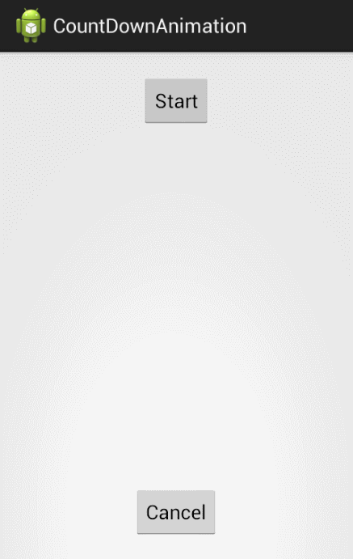

 Count Down Animation
==================

This project includes the [CountDownAnimation](src/com/ivanrf/countdownanimation/CountDownAnimation.java) class and one Activity to test it.

How to use it
-----------

In [TestActivity](src/com/ivanrf/countdownanimation/TestActivity.java) class you will find a complete example.
Basically, you need to provide a ```TextView```, in which the count down will be shown, and the starting count number. Then, simply call ```start()```.

```java
CountDownAnimation countDownAnimation = new CountDownAnimation(textView, startCount);
countDownAnimation.start();
```

In addition, you can cancel the count down at any time by calling ```cancel()```.

Animation
-----------

By default, the class defines a fade out animation. It uses ```AlphaAnimation``` from 1 to 0.
However, it is possible to modify that behaviour by setting another animation. For instance:

```java
// Use scale animation
Animation scaleAnimation = new ScaleAnimation(1.0f, 0.0f, 1.0f, 0.0f,
  		Animation.RELATIVE_TO_SELF, 0.5f, Animation.RELATIVE_TO_SELF, 0.5f);
countDownAnimation.setAnimation(scaleAnimation);
```

Listener
-----------

If you want to do something after the count down finishes you can set a ```CountDownListener```.

```java
countDownAnimation.setCountDownListener(new CountDownListener() {
	@Override
	public void onCountDownEnd(CountDownAnimation animation) {
	  			
	}
});
```

## Download ##
You can [download the latest release](../../releases/latest). The apk file of the test application is provided.

## Screenshots ##
```TestActivity``` with default animation: Alpha


```TestActivity``` with a set of animations: Scale + Alpha
